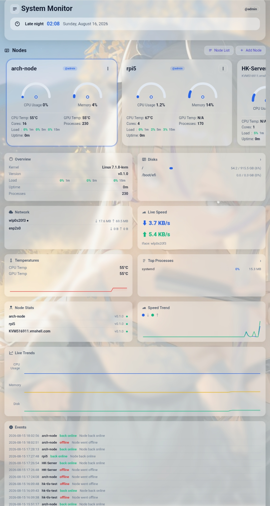

# HyperScope

使用 Rust 构建的去中心化自托管基础设施监控平台：网页面板 + 每台机器的控制面（hyper-relay）+ 按需唤醒的采集端（hyper-node），采用受 Tailscale 启发的控制面/数据面分离架构，全面支持 TLS（WSS）。

[English](README.md) | [中文](README.zh-CN.md) | [Русский](README.ru-RU.md)



## 项目概览

HyperScope 通过一个中心面板统一监控多台 Linux 和 Windows 机器，架构上受 **Tailscale** 启发：**控制面与数据面分离**——控制面（hyper-relay）只做信令（按需唤醒采集端），数据面由各节点本地采集，不依赖中心服务器持续转发。项目为 Cargo workspace，包含共享核心库、网页面板与 `hyper-node` 采集端。

**去中心化**：每台被监控机器自带控制面（hyper-relay）与采集端（hyper-node），面板只是"观察者"——即使面板离线，各节点仍独立运行、随时可被本机或对端唤醒。

```text
hyper-node（Linux 或 Windows 采集端，不常驻、不监听端口）
        ^  按需唤醒（本地进程）
        |
hyper-relay（每台机器上的控制面，唯一常驻服务，只做信令，默认 :8686）
        ^  WSS/TLS 控制面连接
        |
hyper-panel（网页聚合服务与 REST API，默认 :8088）
```

Workspace crate：

| Crate | 职责 |
|---|---|
| `hyper-panel-core` | 共享领域模型、协议 DTO、持久化、轮询和安全节点网络能力 |
| `hyper-scope` | 运行在被监控机器上的 `hyper-node` 采集端二进制 |
| `hyper-panel` | Axum 网页面板、REST API、认证和节点聚合 |

## 核心功能

- **去中心化架构**：控制面与数据面分离（受 Tailscale 启发）——控制面只做信令，采集端按需唤醒、不常驻
- 实时监控 CPU、内存、温度、磁盘、网络、进程、I/O、TCP 和系统日志
- Docker 容器列表，以及启动、停止、重启和删除操作
- SQLite 历史数据、聚合视图和 CSV 导出
- 通过网页面板或 CLI 管理节点：添加、导入、重命名、ping 和删除
- 中继模式：采集端不监听任何端口——hyper-relay（唯一常驻服务）按需唤醒它采集
- 管理员账户（argon2 密码哈希、登录限速）
- TLS 1.3（WSS）、证书指纹固定、每节点 API key
- Linux systemd 和 Windows 服务部署路径
- 中文、英文和俄文网页界面
- **告警检测**（CPU / 内存 / 磁盘 / 温度阈值，以及未运行的 Docker 容器）+ 铃铛通知面板，持久化到磁盘，与事件日志完全分离
- **Webhook 告警推送**：每节点可选通知渠道（PushPlus / Server 酱 / Telegram / 自定义 Webhook）+ 可配置的每节点阈值。告警无需人工值守即可推送至移动设备或即时通讯工具
- **节点分组**：节点列表上方按分组筛选
- **审计日志**：管理操作（删除节点、修改用户密码等）记入事件流，含操作者和时间
- **节点管理弹窗**：单个添加、批量添加、批量勾选删除、批量导出加密 `.hsxc` 配置文件
- **本地加密配置导入/导出**（`.hsxc`）：AES-256-GCM + PBKDF2，网页面板与安卓端完全互通，本地解密，数据不离开设备
- **安卓客户端**（`android/`）：本地面板，直连各 hyper-node 或经其 hyper-relay（无需监听端口），含半圆速度针仪表盘、CPU/内存趋势图（重启后保留）、自定义卡片排序、健康状态徽标、节点分组、.hsxc 导出、告警系统通知、Material You 动态配色，以及机器操控页（重启 / 关机 / 查看并停止进程 / Docker 启停重启）

## 快速开始

### Linux 采集端和网页面板

在每台被监控机器上安装采集端，在一台服务器上安装面板：

```bash
curl -fsSL https://raw.githubusercontent.com/saves24/HyperScope/main/install.sh | sudo bash -s node
sudo hyper-node key setup
sudo systemctl enable --now hyper-relay
sudo hyper-node key show
```

```bash
curl -fsSL https://raw.githubusercontent.com/saves24/HyperScope/main/install.sh | sudo bash -s panel
sudo systemctl enable --now hyper-panel
```

打开 `http://<服务器>:8088`，使用初始账户 `admin` / `admin` 登录，并立即修改密码：

```bash
sudo hyper-panel user passwd admin
```

添加节点地址以及 `hyper-node key show` 输出的完整内容，包括 `|SHA256:...` 指纹。面板会自动启用 TLS 和指纹固定。面板自身提供的是 HTTP；远程暴露前请放在 HTTPS 反向代理或私有网络之后。

**信任控制设备**（远程命令必需）：中继命令使用设备 Ed25519 密钥签名。在每个节点上，将面板/手机设备加入信任列表：

```bash
# 在节点上执行，使用设备的公钥（由面板/手机显示）：
sudo hyper-node device add <设备ID> <设备公钥> admin
sudo hyper-node device list
```

### Windows 采集端

使用安装脚本（推荐）——脚本会注册 hyper-relay 服务（开机自启、无需登录），采集端由它按需唤醒。**以管理员身份**打开 PowerShell，下载并运行脚本：

```powershell
# 下载安装脚本，然后带指定 key 运行
Invoke-WebRequest -Uri 'https://raw.githubusercontent.com/saves24/HyperScope/main/deploy/install-windows.bat' -OutFile install-windows.bat
.\install-windows.bat <你的API Key>

# 或先不设 key（之后手动设置）
.\install-windows.bat
```

配置保存在 `C:\ProgramData\hyper-node`。Windows 指标使用 `sysinfo`，温度在可用时使用 WMI，重启和关机使用 Windows 原生命令。

脚本会依次完成：

1. 从最新 Release 下载 `hyper-node-windows-amd64.exe` 和 `hyper-relay-windows-amd64.exe` 到 `C:\ProgramData\hyper-node\`
2. 设置 API Key（传入参数时），并把 key 文件权限收紧为仅 `SYSTEM`/`Administrators` 可读
3. 注册并启动服务 `hyper-relay`（自启）。采集端不注册服务，由 hyper-relay 按需唤醒

安装后验证并获取 Key：

```powershell
sc query hyper-relay                          # 服务状态（应为 RUNNING）
C:\ProgramData\hyper-node\hyper-node.exe key show   # 复制完整值（含 |SHA256:... 指纹）
```

然后在面板添加节点：节点地址 + 完整 Key。

同时信任控制设备（面板/手机），远程命令才能被接受：

```powershell
C:\ProgramData\hyper-node\hyper-node.exe device add <设备ID> <设备公钥> admin
C:\ProgramData\hyper-node\hyper-node.exe device list
```

卸载（同样以管理员身份）：

```powershell
Invoke-WebRequest -Uri 'https://raw.githubusercontent.com/saves24/HyperScope/main/deploy/uninstall-windows.bat' -OutFile uninstall-windows.bat
.\uninstall-windows.bat
```

注意事项：

- 脚本下载使用 `Invoke-WebRequest`；若被 PowerShell 拦截，先允许 TLS 1.2：`[Net.ServicePointManager]::SecurityProtocol = [Net.SecurityProtocolType]::Tls12`
- 服务无需登录用户即可运行。如需前台运行（例如调试），使用 `hyper-node.exe relay`
- Windows 指标使用 `sysinfo`，温度在可用时使用 WMI，重启和关机使用 Windows 原生命令。

## 技术栈

- Rust 2021 与 resolver 2 的 Cargo workspace
- 面板和采集端服务使用 Axum、Tokio
- 使用 reqwest、rustls、tokio-tungstenite 实现认证 HTTP/TLS/WebSocket 传输
- 使用 SQLite 保存历史数据
- 使用 serde/serde_json 定义协议 DTO
- 使用 sysinfo 及 Linux、Windows 平台集成采集指标

## 平台支持

| 能力 | Linux | Windows |
|---|---|---|
| CPU、内存、磁盘、网络、进程 | 支持 | 支持 |
| 磁盘 I/O 和 TCP 连接 | 支持 | 支持 |
| 温度 | 原生传感器 | WMI（可用时） |
| GPU 温度 | NVIDIA / AMD 集成 | 通过 `nvidia-smi` 支持 NVIDIA |
| Wi-Fi SSID 和信号 | 未提供 | `netsh` |
| 日志 | 系统日志 | Windows 事件日志 |
| Docker | Docker socket/CLI | Docker Desktop CLI |
| 监听端口 | 取决于平台 | `netstat` |
| 重启和关机 | 支持 | 支持 |
| 服务部署 | systemd | Windows 服务 |

## 文档

- [节点配置示例](nodes.example.json)

## P2P 中继协议（hyper-relay）

节点通过 `hyper-relay` 代理实现**不监听任何端口**运行：中继（与节点安装在同一台机器）是唯一常驻服务并只暴露一个端口；采集端通过本地进程 **按需唤醒**（`hyper-node collect` / `hyper-node control`）。端到端 Ed25519 签名保证即使中继或网页面板被攻破，命令仍然可信。

- **安装**：`install.sh` / `install-windows.bat` 会在同一台机器上同时安装 `hyper-relay`（系统服务）和 `hyper-node`（按需唤醒）
- **采集**：中继每次轮询按需唤醒本机 `hyper-node collect`；采集端不是常驻服务
- **数据路径**：安卓/网页面板只通过中继（控制面）与采集端通讯——不做任何直连；中继按需唤醒本机采集端并返回最新快照
- **命令**：设备密钥签名；高危操作（SSH / 升级系统 / 安装软件）需要第二个管理员确认
- **TLS（WSS）**：`hyper-relay serve --tls-cert <pem> --tls-key <pem>` 以 wss:// 提供加密连接——公网节点建议启用（自签证书即可，客户端接受自签）；内网节点启用也不增加可感知延迟（AES 硬件加速）
- **证书管理**：证书是**机器无关**的——可以在任意一台机器生成，复制到其他机器共用（`hyper-node cert import <cert.pem> <key.pem>`），或每台独立生成（`hyper-node cert gen`）。家庭/内网环境推荐共享证书（管理简单）；公网/多租户环境建议独立证书（审计/隔离）
- **账号模型**：可信设备密钥只存在节点本地（`/etc/hyper-node/trusted.toml`）；网页面板不持有任何密钥

## 安全说明

面板设计用于**私有局域网**，不应暴露到公网。请将其部署于家庭网络 / VPN 内，并从可信设备访问。

采集端默认使用 TLS 1.3，并自动生成自签证书。面板首次连接时会固定证书指纹（TOFU），每个节点还要求自己的 API key。将面板客户端证书指纹加入节点信任列表即可启用双向 TLS：

```bash
hyper-node trust add SHA256:<面板证书指纹>
```

不要在不可信网络中使用明文模式。远程使用前请修改默认面板密码，并通过防火墙或私有网络保护节点和面板端口。

## 命令

### 网页面板 CLI（`hyper-panel`）

```text
hyper-panel node add <地址> <key>              添加节点（默认端口 8686；支持批量：{地址 key}{地址 key}...；--tls 启用加密连接）
hyper-panel node link [--tls|--plain] <地址> <key>  连接节点（--tls 加密 / --plain 明文测试；默认：key 包含指纹时自动 TLS）
hyper-panel node add -f <文件>                  从文件批量导入节点（每行 "地址[:端口] key"）
hyper-panel node rename <名称> <新名称>          重命名节点
hyper-panel node ping <名称>                    测试节点可达性
hyper-panel node del <名称>                     从配置中删除节点
hyper-panel node list                           列出所有已配置节点
hyper-panel node show <名称>                    显示节点详情（包括连接状态）
hyper-panel setup [--user <用户名>]             创建/重置管理员账户（默认 admin，交互式密码）
hyper-panel user passwd <用户名>                修改管理员密码（交互式）
hyper-panel port [N]                            查看/设置面板端口（默认 8088，重启生效）
hyper-panel log show [N]                        查看面板日志（最后 N 行，默认 50）
hyper-panel log system [N]                      查看主机 systemd 服务日志（journalctl -u hyper-panel，默认 50）
hyper-panel log retention <天数>                设置日志保留天数（默认 7）
hyper-panel serve [--port N]                    启动聚合服务（默认 8088）
hyper-panel help                                显示帮助
```

### 采集端 CLI（`hyper-node`）

```text
hyper-node key setup [KEY] [--plain]            设置 API key。未指定 KEY 时自动生成随机 key。
                                                 默认生成证书绑定 key（key 包含证书指纹，适用于 TLS 节点）；
                                                 --plain 生成传统明文 key（适用于非 TLS 节点）
hyper-node key show                             显示当前 API key（含证书指纹格式）
hyper-node cert gen                             生成/续期 TLS 证书（自签名，写入 /etc/hyper-node/）
hyper-node cert import <cert.pem> <key.pem>      导入共享证书
hyper-node cert show                            显示当前证书 SHA256 指纹
hyper-node identity init                       生成 Ed25519 身份密钥（打印公钥）
hyper-node identity show                       显示身份公钥
hyper-node identity sign <消息>                 用身份密钥签名消息
hyper-node device list                         列出可信设备
hyper-node device add <id> <公钥> <角色>         信任设备（owner|admin|viewer）
hyper-node device remove <id>                  移除可信设备
hyper-node relay | serve                       以中继模式运行采集端（无监听端口；指标经 hyper-relay 按需提供）
hyper-node log retention N                      设置日志保留天数（默认 7，自动清理）
hyper-node log show                             显示日志保留配置
hyper-node trust add <指纹>                     信任面板客户端证书指纹（mTLS）
hyper-node trust list                           列出所有已信任的证书指纹
hyper-node trust clear                          清除所有已信任的证书指纹
hyper-node help                                 显示帮助
```

## 许可证

HyperScope 使用 [MIT License](LICENSE) 发布。
